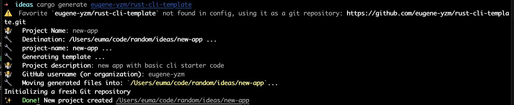
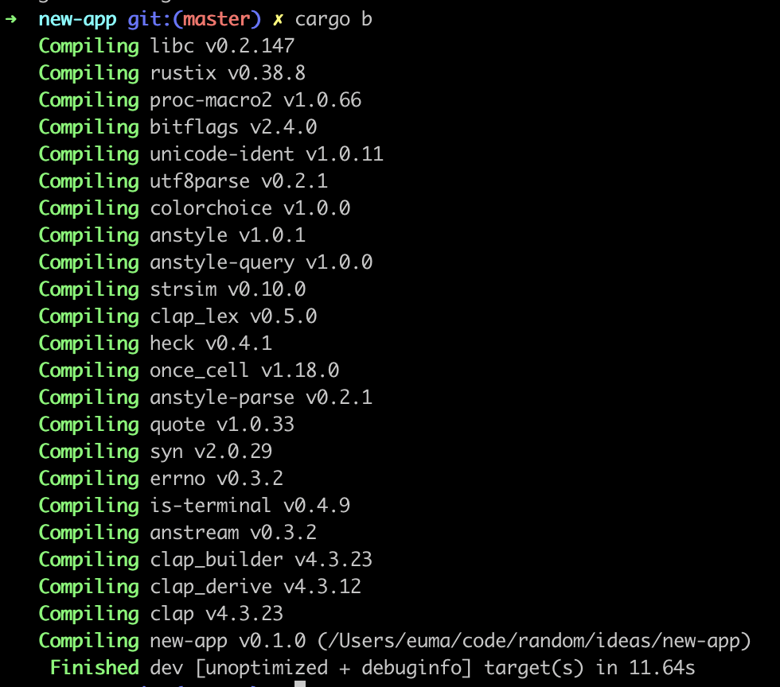
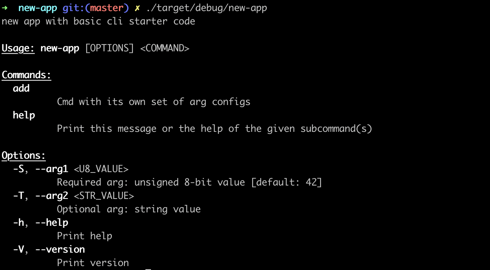

# Rust CLI Template

This is a project template which can be used as a quickstart to building a Rust application with a CLI interface.  It is using the fairly ubiquitous [clap library](https://docs.rs/clap/latest/clap/) to power argument parsing.  The design choice is mainly due to the level of adoption and maintenance which `clap` offers.

Motivations: After playing around with the C# and .NET toolchains, I've realized how powerful it is to be able to get a running start on projects and ideas.  Hopefully this will be useful in lowering the entry barrier for others to start building with Rust.

## Usage

### Prerequisites
* Install the rust toolchain in order to have cargo installed by following
  [this guide](https://www.rust-lang.org/tools/install).
* Install cargo-generate: `cargo install cargo-generate`.  See [the guide](https://cargo-generate.github.io/cargo-generate/index.html) for more details.

### Steps

1.  Generate your project:
```
cargo generate eugene-yzm/rust-cli-template
```



2. Change into your new project directory:
```
cd <new-project-name>
```


3. Build the project:
```
cargo b
```



4. Run the built binary:
```
./target/debug/<new-project-name>
```



5. Thats all!  Happy building!